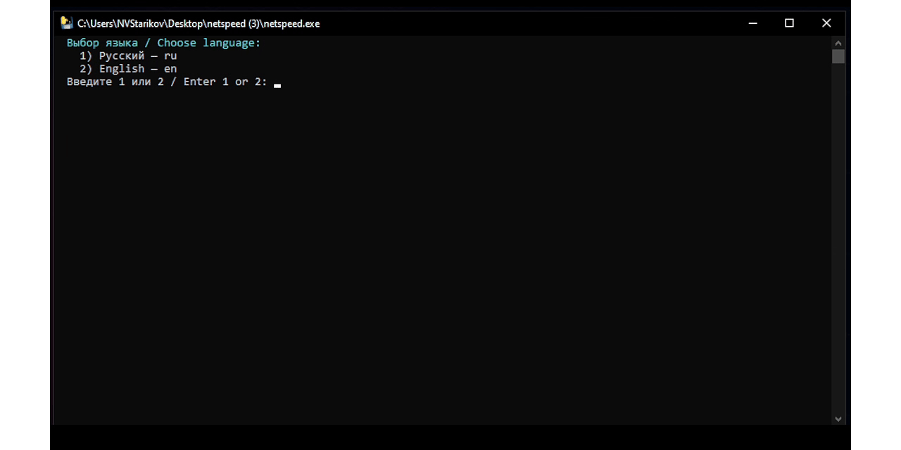

<div align="center">

**🌐 Язык:** Русский · [English](README_EN.md)

<br>

  

  <h1>NetSpeed</h1>
  <p><b>Честный замер скорости интернета</b></p>
  <p>Показываем реальный потолок вашей линии — а не «цифру для галочки»</p>

  [](https://github.com/nvstarikov/netspeed/releases/latest)
  [](https://github.com/nvstarikov/netspeed)
  [](#-двуязычный-интерфейс)
  [](LICENSE)

  [📥 Скачать](https://github.com/nvstarikov/netspeed/releases/latest) ·
  [🌐 netspeed.stargrd.ru](https://netspeed.stargrd.ru/) ·
  [🏠 stargrd.ru](https://stargrd.ru)

</div>

---



---

## 🎯 Что такое NetSpeed

**NetSpeed** — утилита для честного замера скорости интернета с учётом российских реалий. В отличие от популярных онлайн-спидтестов, она:

- Измеряет **8 потоками** — раскрывает канал полностью, а не 20–30% как браузер
- Учитывает **физический потолок** вашей сетевой карты (линк) — сразу видно, если кабель режет скорость
- Показывает **реальный вердикт**: сколько процентов от тарифа вы получаете на самом деле
- **Сохраняет историю** замеров в Markdown-таблицу — готовый аргумент для претензии провайдеру

---

## ✨ Возможности

| Возможность | Описание |
|-------------|----------|
| 🔗 **Линк-детектор** | Показывает согласованную скорость адаптера (100 Мбит / 1 Гбит / 2.5 Гбит) |
| 📡 **Пинг до DNS** | 10 пакетов до 77.88.8.8 с расчётом джиттера |
| ⬇️ **Download РФ** | 8 потоков с зеркала Яндекса — главный замер |
| ⬆️ **Upload РФ** | 4 потока на Selectel — реальный исходящий потолок |
| 🌍 **Зарубежные узлы** | Справочная попытка с Hetzner и Tele2 (недоступность = норма для РФ) |
| 📊 **Режим мониторинга** | `netspeed.exe --watch` — замер каждые 5 минут + ASCII-график |
| 📝 **Markdown-история** | Автосохранение всех замеров в `netspeed_history.md` |
| 💬 **Вердикты** | Понятный статус: Отлично / Хорошо / Мало с процентом от тарифа |
| 🌐 **Двуязычный интерфейс** | Русский и английский на выбор |

---

## 🌐 Двуязычный интерфейс

NetSpeed поддерживает **русский** и **английский** языки с первого запуска.

При первом старте программа спросит язык интерфейса. Сменить можно в любой момент:

```bash
netspeed.exe --lang ru     # Русский
netspeed.exe --lang en     # English
