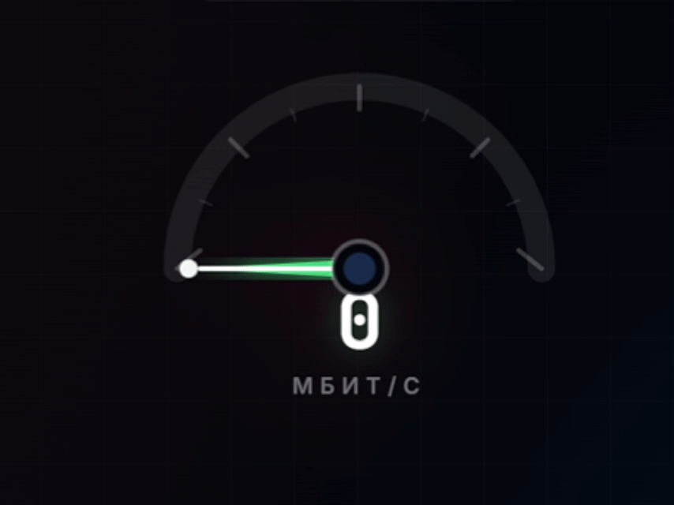

<div align="center">

**🌐 Language:** [Русский](README.md) · English

<br>

 

  <h1>NetSpeed</h1>
  <p><b>An honest internet speed test</b></p>
  <p>We show the real ceiling of your line — not a "number for show"</p>

  [](https://github.com/nvstarikov/netspeed/releases/latest)
  [](https://stargrd.ru/launcher/)
  [](https://github.com/nvstarikov/netspeed)
  [](#-bilingual-interface)
  [](LICENSE)

  [📥 Download](https://github.com/nvstarikov/netspeed/releases/latest) ·
  [🌐 netspeed.stargrd.ru](https://netspeed.stargrd.ru/) ·
  [🏠 stargrd.ru](https://stargrd.ru)

</div>

---


---

## 🎯 What is NetSpeed

**NetSpeed** is an internet speed test utility built with Russian networks in mind. Unlike popular online speed tests, it:

- Measures with **8 parallel streams** — reveals the full channel capacity, not the 20–30% a browser can push
- Detects the **physical link ceiling** of your network adapter — instantly shows if the cable limits you
- Gives a **real verdict**: what percentage of your plan you actually get
- **Saves history** of measurements as a Markdown table — ready evidence for an ISP complaint

---

## ✨ Features

| Feature | Description |
|---------|-------------|
| 🔗 **Link detector** | Reports the negotiated speed of your adapter (100 Mbps / 1 Gbps / 2.5 Gbps) |
| 📡 **Ping to DNS** | 10 packets to 77.88.8.8 with jitter calculation |
| ⬇️ **Download (RU)** | 8 streams from Yandex mirror — the primary measurement |
| ⬆️ **Upload (RU)** | 4 streams to Selectel — your real upload ceiling |
| 🌍 **Foreign nodes** | Reference test via Hetzner and Tele2 (unreachable = normal for RU) |
| 📊 **Monitoring mode** | `netspeed.exe --watch` — measure every 5 min with an ASCII history graph |
| 📝 **Markdown history** | All measurements saved automatically to `netspeed_history.md` |
| 💬 **Verdicts** | Clear status: Excellent / Good / Poor with the % of your plan |
| 🌐 **Bilingual UI** | Russian and English to choose from |

---

## 🌐 Bilingual interface

NetSpeed supports **Russian** and **English** from the first launch.

On first start, the program asks for your preferred language. You can switch anytime:

```bash
netspeed.exe --lang ru     # Russian
netspeed.exe --lang en     # English
